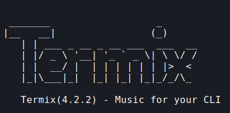

# Termix3X


   
- The build application is now available!
## Installation

### Clone the project

```bash
  git clone https://link-to-project
```

### Go to the project directory

```bash
  cd my-project
```
### Activate virtual environment

For Linux
```bash
  source env/bin/activate 
```
For Windows
```bash
  source env/bin/active.ps1
```
### To Run

Running the file for the first time would create the config files and running it again would start the app

```bash
python main.py
```
To reconfig the config files

```bash
python main.py reconfig
```

#
To deactivate the env

```bash
  deactivate
```
#
- Now you can also download the build file and run it directly (having all the dependecies installed)
#


## Authors

- [@PratyushTheCoder](https://www.github.com/PratyushTheCoder)

